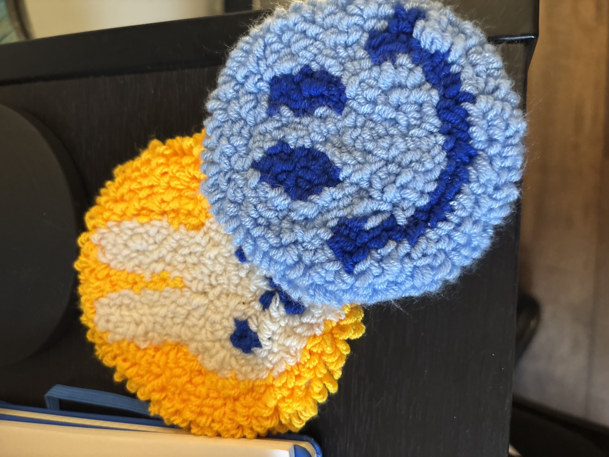

I love learning and trying new things! :) When I’m not at my computer, here is what I’m usually up to:

<html>
<head>
    <link rel="stylesheet" href="../styles.css">
</head>
<body>
    

        

            
            <h3>Punch Needling</h3>
            
I picked this up as a fun, quick way to make custom gifts for family and friends!

            <a href="/fun/punch-needling/" target="_blank" class="btn">See my creations</a>
        

        

            
            <h3>Traveling & Languages</h3>
            
I find it rewarding and fun to learn new languages for connecting with people when I travel! My latest adventures were in Vietnam and Japan.

        

        

            <h3>Anime & Manga</h3>
            
Believe it or not, but I'm caught up in the One Piece anime! 🏴‍☠️ (Not the manga, I switched to watching it)

        

        

            <h3>Music & Singing</h3>
            
I played clarinet for 7 years in middle and high school band. Now, I'm learning ukulele (when I can find time) and I'm always down for karaoke! 🎤

        

        

            <h3>Yoga & Exercise</h3>
            
After a long day of studies or work, I like to decompress with yoga or a session at the gym. 🧘🏽‍♀️

        

        

            <h3>Hiking & Walking</h3>
            
As cliché as it sounds, I love being in nature. A long hike or a walk is really nice for resting my eyes and pondering things.

        

        

            <h3>Currently Reading:</h3>
            <ol>
            <li><i>Designing ML Systems</i> by Chip Huyen</li>
            <li><i>Artificial Intelligence: A Guide for Thinking Humans</i> by Melanie Mitchell</li>
        

    

</body>
</html>