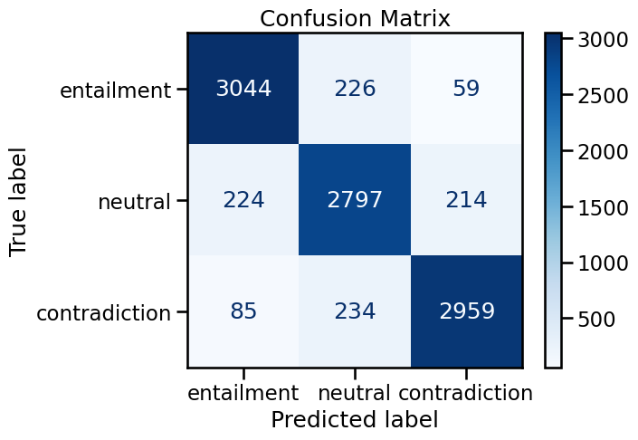
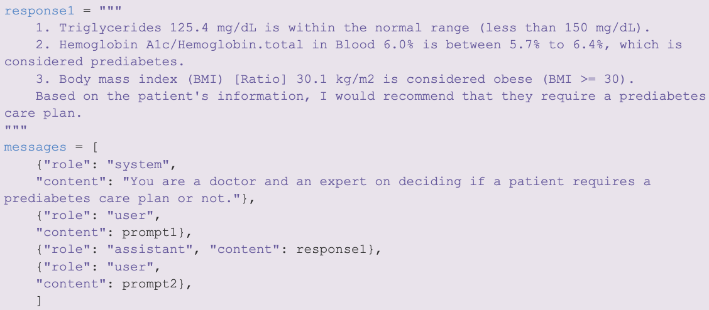
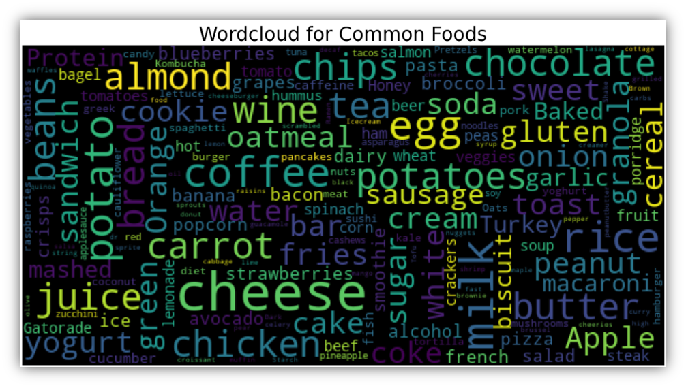

<html>
<head>
    <link rel="stylesheet" href="../styles.css">
</head>
<body>
    

        <!-- Card 1 -->
        

            
            <h3>VQA for Bioavailable Iron using Small VLMs</h3>
            
Can small VLMs predict bioavailable iron?

            <a href="https://github.com/chelseanbr/smolvlm-nutrition-vqa" class="btn">View on GitHub</a>
        

        <!-- Card 2 -->
        

            
            <h3>Improving NLI Robustness via Targeted Fine-Tuning</h3>
            
Breaking and fixing the SNLI benchmark.

            <a href="https://github.com/chelseanbr/nli-robustness-electra" class="btn">View on GitHub</a>
        

        <!-- Card 3 -->
        

            
            <h3>Fine-Tuning TinyLlama for Medical QA</h3>
            
LoRA + CoT rejection sampling to answer layperson medical questions.

            <a href="https://github.com/chelseanbr/tinyllama-medical-qa" class="btn">View on GitHub</a>
        

        <!-- Card 4 -->
        

            
            <h3>LLM Tutorial for AI in Healthcare</h3>
            <a href="https://github.com/chelseanbr/aih-llm" class="btn">View on GitHub</a>
        

        <!-- Card 5 -->
        

            
            <h3>EDA & Predictive Modeling Tutorial for AI in Healthcare</h3>
            <a href="https://github.com/chelseanbr/aih-eda-modeling" class="btn">View on GitHub</a>
        

        <!-- Add more cards as needed -->
    

</body>
</html>